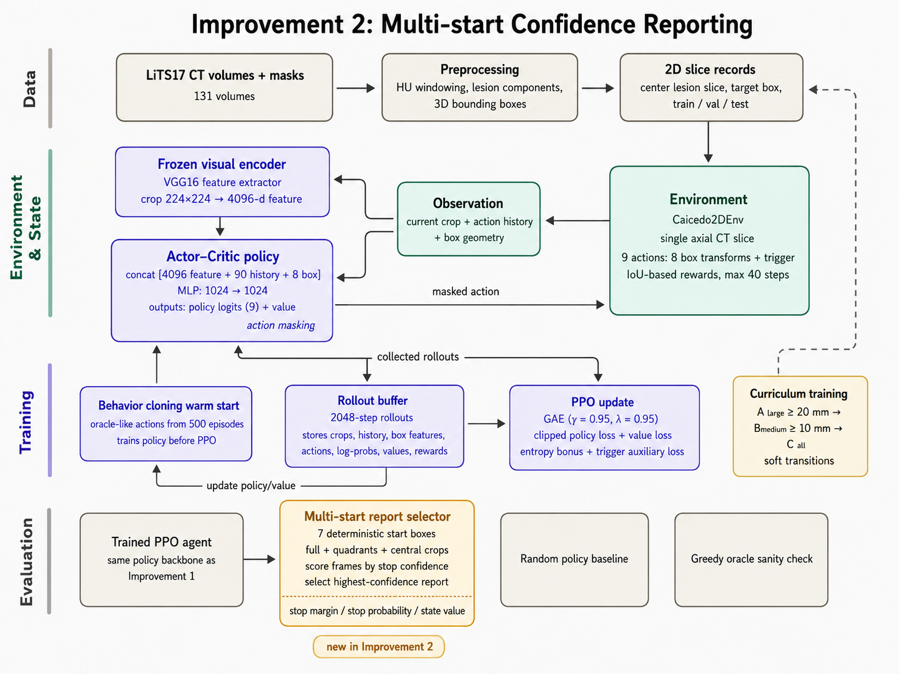

# Active Lesion Localization with DQN and PPO

This repository implements a deep reinforcement learning pipeline for 2D active lesion localization in CT slices from the LiTS liver tumor segmentation dataset. The project compares a Caicedo-style DQN baseline with two PPO-based improvements that stabilize localization behavior and improve reported bounding-box quality.



## Table of Contents

- [Project Overview](#project-overview)
- [Project Team](#project-team)
- [Repository Structure](#repository-structure)
- [Getting Started](#getting-started)
- [Key Innovations](#key-innovations)
  - [DQN-Style Active Localization Baseline](#dqn-style-active-localization-baseline)
  - [Stabilized PPO Localizer](#stabilized-ppo-localizer)
  - [Multi-start Confidence Reporting](#multi-start-confidence-reporting)
- [Experimental Results](#experimental-results)
- [Citations](#citations)

## Project Overview

Active lesion localization treats object localization as a sequential decision problem. An agent starts with an image-level bounding box and repeatedly applies discrete transformations until it triggers a final localization decision. In these notebooks, LiTS 3D tumor annotations are converted into axial 2D lesion records, and the agent learns to localize lesion boxes using CT crops, action history, and normalized box geometry.

The project follows three notebook stages:

1. **Baseline**: DQN-style active localization with replay memory and a frozen VGG16 fc6 visual encoder.
2. **Improvement 1**: Stabilized PPO localizer with behavior cloning warmup, action masking, curriculum learning, clipped value loss, and trigger auxiliary loss.
3. **Improvement 2**: PPO with multi-start confidence reporting, where the trained policy is evaluated from 7 deterministic start boxes and a learned stop-confidence score selects the reported box.

Core notebook settings:

- Dataset path: `/kaggle/input/datasets/javariatahir123/lits17-liver-tumor-segmentation`
- Expected dataset folders: `CT_Vol/CT_Vol` and `CT_Mask/CT_Mask`
- CT windowing: HU range `[-200, 300]`
- Image crop size: `224 x 224`
- Action space: 9 actions, including 8 box transformations and 1 trigger action
- Maximum episode length: 40 steps
- Random seed: 42
- Metadata split: 89 train volumes, 14 validation volumes, and 15 test volumes
- 2D records: PPO notebooks report 624 train, 132 validation, and 128 test records; the baseline notebook reports 623 train, 132 validation, and 128 test records

## Project Team

| Field | Value |
|---|---|
| Name 1 | Muhammad Hamdan Sikandar |
| Rollnumber 1 | 27100326 |
| Name 2 | Hadi Shazad Khan |
| Rollnumber 2 | 27100475 |

## Repository Structure

```text
Lession_Detection_in_RL/
|-- README.md
|-- Baseline-Final.ipynb                         # DQN-style active localization baseline
|-- Improvement_1.ipynb                          # Stabilized PPO localizer
|-- Improvement_2.ipynb                          # PPO with multi-start confidence reporting
`-- Architecture-diagrams/
    |-- baseline-architecture.png                # Baseline architecture visualization
    |-- Improvement-1-architecture.png           # PPO improvement architecture
    `-- Improvement-2-architecture.png           # Multi-start reporting architecture
```

## Getting Started

### Prerequisites

- Python 3.8+
- PyTorch
- torchvision
- numpy
- scipy
- nibabel
- matplotlib
- pandas
- Jupyter or Kaggle Notebook

The recommended runtime is a Kaggle Notebook with GPU enabled, because the notebooks expect the LiTS dataset at the Kaggle input path shown above.

### Running the Code

1. Clone the repository:

```bash
git clone https://github.com/Dannyism11/Lession_Detection_in_RL.git
cd Lession_Detection_in_RL
```

2. Install local editing dependencies if you are not running on Kaggle:

```bash
python -m pip install torch torchvision numpy scipy nibabel matplotlib pandas jupyter
```

3. Attach the LiTS dataset in Kaggle at:

```text
/kaggle/input/datasets/javariatahir123/lits17-liver-tumor-segmentation
```

4. Run the notebooks in order:

```text
Baseline-Final.ipynb
Improvement_1.ipynb
Improvement_2.ipynb
```

The notebooks generate checkpoints, metric tables, JSON summaries, training logs, and qualitative rollout visualizations under:

```text
/kaggle/working/caicedo_baseline_final
/kaggle/working/improvement_1
/kaggle/working/improvement_2
```

## Key Innovations

### DQN-Style Active Localization Baseline

The baseline implements a Caicedo-style active localization environment. The state combines VGG16 fc6 features, a 10-step action history, and normalized box geometry. The policy predicts Q-values for 9 localization actions.

The baseline trains for 8 epochs using replay memory, target-network updates, guided exploration, reversal suppression, and no-op action masking.

### Stabilized PPO Localizer

Improvement 1 replaces the DQN value policy with a PPO actor-critic model. It keeps the frozen VGG16 feature extractor but adds a shared policy/value torso over visual features, action history, and box geometry.

The PPO notebooks use:

- 80,000 total timesteps
- 2,048 steps per rollout
- 2 PPO epochs per update
- minibatch size 64
- policy learning rate `3e-5`
- gamma `0.95`
- GAE lambda `0.95`
- clip coefficient `0.10`
- clipped value loss with value clip `0.20`
- entropy annealing from `0.001` to `0.00015`
- behavior cloning warmup over 500 episodes for 5 epochs
- action masking to avoid invalid actions and immediate reversals
- trigger auxiliary loss for better stop-action learning
- curriculum phases over lesion diameter: `A_large >= 20 mm`, `B_medium >= 10 mm`, and `C_all >= 0 mm`

The trigger reward is threshold-centered around IoU 0.50.

### Multi-start Confidence Reporting

Improvement 2 keeps the PPO training setup and changes the reporting protocol. Instead of relying on one rollout from the full-image start box, the notebook evaluates 7 deterministic start boxes and chooses the reported frame with a learned stop-confidence score.

Notebook reporting configuration:

- Report protocol: `multistart_stop_confidence_report`
- Number of start boxes: 7
- Timeout box selection: `stop_margin`
- Report best on timeout: `True`
- Report best on trigger: `False`
- Minimum report step: 1
- Maximum report box area fraction: 0.75

## Experimental Results

The following values are taken from the final evaluation cells in the executed notebooks.

| Model | Split | n | Mean Final IoU | Mean Best IoU | Final@0.25 | Final@0.5 | Best@0.25 | Best@0.5 |
|---|---|---:|---:|---:|---:|---:|---:|---:|
| Baseline | Validation | 100 | 0.1339 | 0.2026 | 0.2100 | 0.0100 | 0.3200 | 0.0500 |
| Baseline | Test | 100 | 0.0569 | 0.1287 | 0.0547 | 0.0078 | 0.2266 | 0.0469 |
| Improvement 1 | Validation | 100 | 0.1094 | 0.4639 | 0.1700 | 0.0500 | 0.7200 | 0.5800 |
| Improvement 1 | Test | 100 | 0.0444 | 0.1344 | 0.0600 | 0.0200 | 0.2200 | 0.0400 |
| Improvement 2 | Validation | 100 | 0.1578 | 0.5283 | 0.2300 | 0.0400 | 0.7800 | 0.6500 |
| Improvement 2 | Test | 100 | 0.0816 | 0.2342 | 0.1200 | 0.0500 | 0.3500 | 0.1600 |

Experimental configuration:

| Setting | Baseline | Improvement 1 | Improvement 2 |
|---|---:|---:|---:|
| Max training records | 300 | 300 | 300 |
| Max validation records | 100 | 100 | 100 |
| Test records evaluated | 128 | 100 | 100 |
| Max steps per episode | 40 | 40 | 40 |
| Training budget | 8 epochs | 80,000 timesteps | 80,000 timesteps |
| Visual encoder | Frozen VGG16 fc6 | Frozen VGG16 features | Frozen VGG16 features |
| Behavior cloning warmup | No | Yes | Yes |
| Curriculum learning | No | Yes | Yes |
| Action masking | Yes | Yes | Yes |
| Multi-start reporting | No | No | Yes |
| Number of start boxes | 1 | 1 | 7 |

Key observations:

1. **Improvement 1** substantially increases validation best-trajectory localization, raising validation mean best IoU from `0.2026` to `0.4639`.
2. **Improvement 2** gives the strongest final reported validation and test performance in the final tables, reaching test mean final IoU `0.0816` and test mean best IoU `0.2342`.
3. **Multi-start confidence reporting** has mixed per-record diagnostics: the notebook reports mean multistart gain `-0.0265` on validation and `0.0245` on test, with improved-rate `0.25` on validation and `0.13` on test.

## Citations

- [Active Object Localization with Deep Reinforcement Learning - Caicedo and Lazebnik](https://arxiv.org/abs/1511.06015)
- [Proximal Policy Optimization Algorithms - Schulman et al.](https://arxiv.org/abs/1707.06347)
- [Very Deep Convolutional Networks for Large-Scale Image Recognition - Simonyan and Zisserman](https://arxiv.org/abs/1409.1556)
- [The Liver Tumor Segmentation Benchmark (LiTS) - Bilic et al.](https://pubmed.ncbi.nlm.nih.gov/36481607/)
